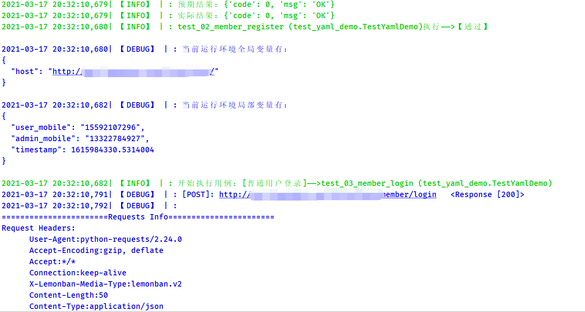
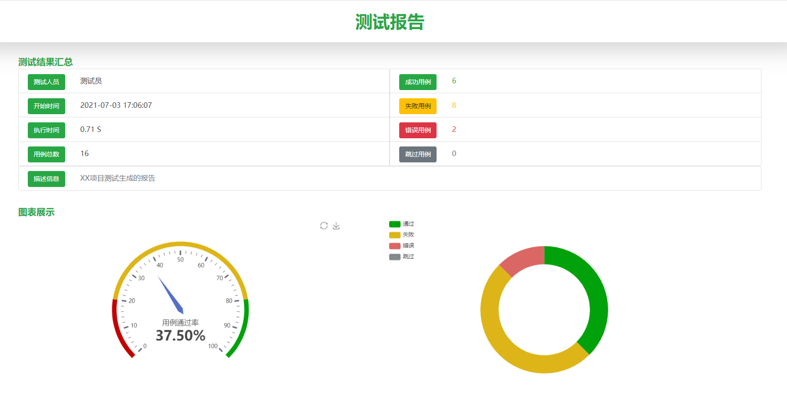
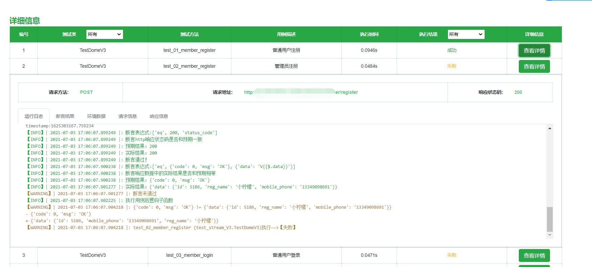
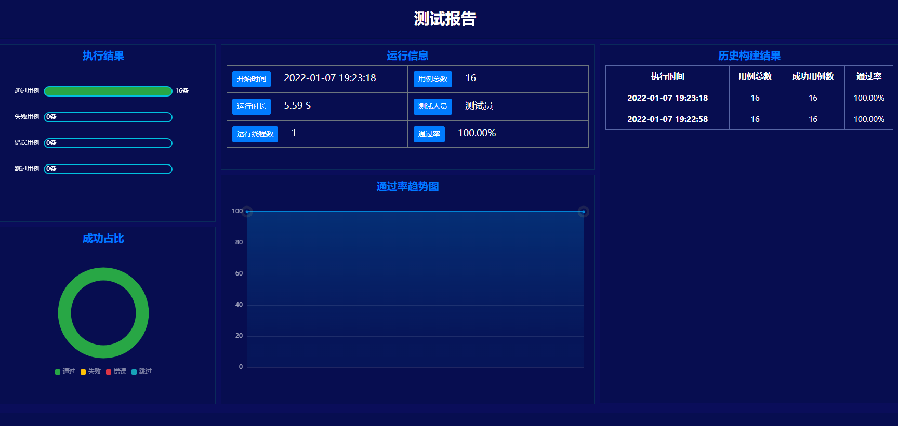
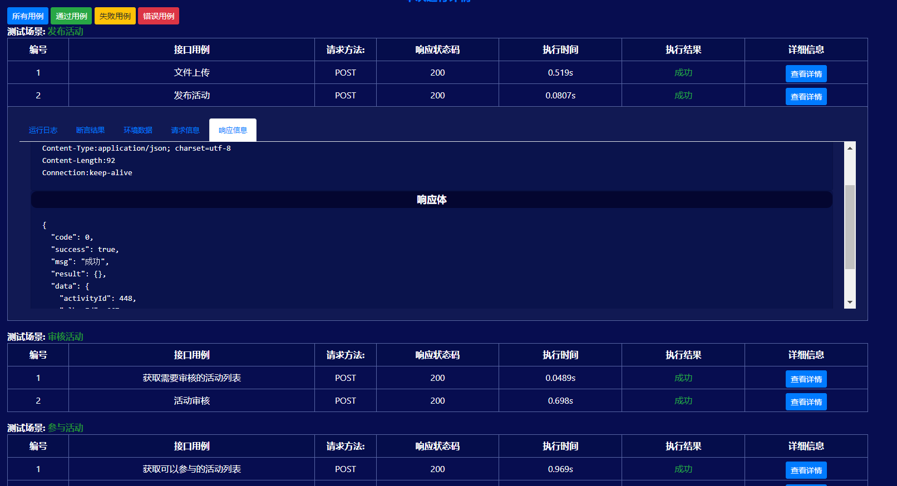

# 

## 1、项目创建

- **创建命令**

``` mst create 项目名```
    
安装好MuskTest之后，打开命令终端输入创建命令，即可在当前路径下创建项目。
    
cd 切换到项目之中，即可看到MuskTest自动为你创建的项目结构
    

```python
├─case_json
│    test_demo1.json
├─case_yaml
│    test_demo2.yaml
├─case_py
│    test_demo3.py
├─reports
│    xxx.html 
├─logs
│    xxxx.log
│ settings.py
│ funcTools.py
│ run.py

```

- **自动生成的项目文件说明**
    -  **case_json**：存放json格式编写的用例文件
        - test_demo1.json :MuskTest生成的json用例文件的demo
    -  **case_yaml**：存放yaml格式编写的用例文件
        - test_demo2.yaml :MuskTest生成的yaml用例文件的 demo 
    -  **case_py**：存放py编写的用例目录
        - test_demo3.py :MuskTest生成的py用例文件demo 
    -  **reports**:报告存放目录
        - xxx.html :生成的测试报告
    -  **logs**：运行日志存放目录
        - xxx.log:运行的测试日志
    -  **setting.py**：整个项目的全局配置文件
    -  **funcTools.py**：自定义的函数工具文件
    -  **run.py**：项目运行入口文件

        

MuskTest用例编写支持yaml文件，json文件，py文件三种方式,如果你是第一次使用，可以参考自动生成的用例demo,如果你的用例采用某一种文件格式来写，其他的两个用例文件目录可以自行删除。

下面来快速了解一下三种用例编写的格式,

## 2、json编写用例


在项目的case_json目录下，定义一个以test开头的json文件，按照**【MuskTest用例编写规范-json】**编写用例即可

```json
[   
    {
      "host": "http://api.XXX.com",
      "interface": "/member/register",
      "method": "post",
      "verification": [
        ["eq", 200, "status_code"]
      ],
      "Cases": [
        {
          "title": "普通用户注册",
          "json":{"mobile_phone":"133010121224","pwd":"musk"}
        },
         {
          "title": "管理员注册",
          "json":{"mobile_phone":"133010121224","pwd":"musk","type": 0}
        }
      ]
    }
]
```


## 3、yaml编写用例

在项目的case_yaml目录下，定义一个以test开头的yaml文件，按照**【MuskTest用例编写规范-yaml】**编写用例即可

```yaml
# 定义一个测试集
- testSet:
    # 域名
    host: http://api.XXX.com
    # 接口
    interface: /member/register
    method: post
    # 校验http响应状态码
    verification:
      - ["eq", 200, 'status_code']
    # 用例数据
    Cases:
      # 用例1：
      - title: 普通用户注册
        json:
          mobile_phone: 13700889999
          pwd: musk
      # 用例2：
      - title: 管理员注册
        json:
          mobile_phone: ${{user_mobile}}
          pwd: musk
          type: 0
```

​    

## 4、py文件编写用例

​	在case_py目录中定义一个以test开头的py文件，定义一个以Test开头的类，并且继承于MuskTest.core.httptest.HttpCase类，按照**【MuskTest用例编写规范-py**】编写用例即可

```python
from musktest.core.httptest import HttpCase

class TestStreamV3(HttpCase):
    host = "http://api.XXX.com"
    interface = "/member/register"
    method = "post"
    verification = [
        ["eq", 200, 'status_code']
    ]
    Cases = [
        # 用例1：普通用户注册
        {
            'title': "普通用户注册",
            'json': {"mobile_phone": "${{user_mobile}}", "pwd": "musk"},
        },
        {
          "title": "管理员注册",
          "json":{"mobile_phone":"133010121224","pwd":"musk","type":0},
        }
    ]
```

## 5、用例运行

- **方式1：**

     终端项目路径下输入命令: ```MuskTest run```
     
     

- **方式2**

     直接使用python运行项目的run.py文件


## 6、测试报告和日志

-  **日志：**项目运行完，会自动在项目路径下生成详细的运行日志

    

-  **测试报告：**MuskTest的测试报告是基第三方库unittestreport生成的

     运行完会在项目目录的reports目录中，自动生成详细的html测试报告。

- 报告样式一
 

 

- 报告样式二
 
 


 