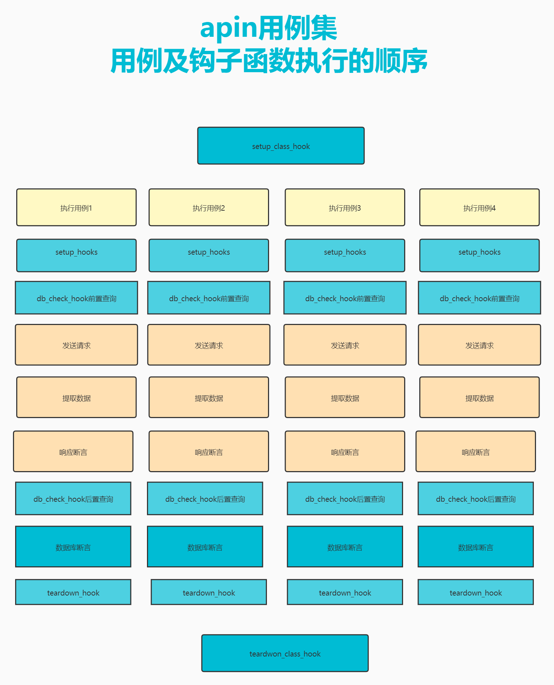

# 


####

apin为了支持自定义用例前后置执行的一些用例数据准备和清理,支持在`funcTools`中自定义钩子函数，并提供了四个字段来指定用例前后置执行的钩子函数。分别为

**`setup_hook`：用例级别前置钩子** （每条用例执行之前会执行）

**`setup_class_hook`:用例级别后置钩子**

**`teardown_hook`:测试集级别前置钩子**

**`teardown_class_hook`:测试集级别前置钩子**

#### 1、setup_hook 

为了方便在用来前置钩子函数中添加和修改环境变量，`setup_hook`的钩子必须定义两个参数，ENV和env，apin在执行钩子函数时会自动化传入。

**钩子函数定义示例**

```python
import random
def random_phone_hook(ENV, env):
    """
    随机生成一个手机号码，保存为全局变量user_phone
    :param ENV: 用来接收全局环境变量
    :param env: 用来接收全局环境变量
    :return:
    """
    phone=''
    for i in range(8):
        phone += str(random.randint(0, 9))
    ENV.user_phone = env  
```

提示：env和ENV是apin种定义的一种增强型的字典，支持字典键值对的形式往里面添加变量，也支持以添加属性的形式来添加变量

**钩子函数的使用**

在写用例数据时可以通过`setup_hook`指定用例级别的前置钩子函数，下面以yaml文件为例

```python
# 域名
host: http://api.lemonban.com/futureloan/
# 指定用例前置钩子函数
setup_hook: random_phone_hook
# 用例数据
Cases:
  # 用例1：普通用户注册
  - title: 普通用户注册
    interface: member/register
    method: post
    json:
      mobile_phone: ${{user_mobile}}
      pwd: lemonban
```


#### 2、setup_class_hook

`setup_class_hook`和setup_hook一样，在定义钩子的时候一样，也需要定义两个参数，ENV和env，在使用的时候通过`setup_class_hook`这个字段指定。

**钩子函数的使用**

下面以yaml文件为例

```python
# 域名
host: http://api.lemonban.com/futureloan/
# 指定测试集前置钩子函数
setup_class_hook: random_phone_hook
# 用例数据
Cases:
  # 用例1：普通用户注册
  - title: 普通用户注册
    interface: member/register
    method: post
    json:
      mobile_phone: ${{user_mobile}}
      pwd: lemonban
```

####  4、teardown_hook

`teardown_hook`在钩子在定义的时候一样，出来需要定义ENV和env之外，还可以定义第三个参数`response`，可以用来接收该用例子请求的响应对象，我们根据自己的需求在后置的钩子函数中，可以对响应对象中的数据进行提取，或者进行其他的操作

**钩子函数的定义**

```python
import random
def get_response_hook(ENV, env,response):
    """
    随机生成一个手机号码，保存为全局变量user_phone
    :param ENV: 用来接收全局环境变量
    :param env: 用来接收全局环境变量
    :param response: 接口请求的响应对象
    :return:
    """
    # 获取响应状态码
    status = response.status_code
    # 获取响应头
    header = response.header
    # 获取响应体的内容
    body= response.text
```

**钩子函数的使用**

```yaml
# 域名
host: http://api.lemonban.com/futureloan/
# 指定测试集前置钩子函数
teardown_hook: get_response_hook
# 用例数据
Cases:
  # 用例1：普通用户注册
  - title: 普通用户注册
    interface: member/register
    method: post
    json:
      mobile_phone: ${{user_mobile}}
      pwd: lemonban
```


####  5、teardown_class_hook

`teardown_class_hook`和前面的setup_hook一样，在定义钩子的时候一样，也需要定义两个参数，ENV和env，在使用的时候通过`teardown_class_hook`这个字段指定钩子函数。

**钩子函数的定义**

```python

def del_phone_hook(ENV, env):
    """
    删除全局变量种的user_phone
    :param ENV: 用来接收全局环境变量
    :param env: 用来接收全局环境变量
    :return:
    """
    del ENV['user_phone']
```


**钩子函数的使用**

下面以yaml文件为例

```python
# 域名
host: http://api.lemonban.com/futureloan/
# 指定测试集前置钩子函数
teardown_class_hook: del_phone_hook
# 用例数据
Cases:
  # 用例1：普通用户注册
  - title: 普通用户注册
    interface: member/register
    method: post
    json:
      mobile_phone: ${{user_mobile}}
      pwd: lemonban
```


 
